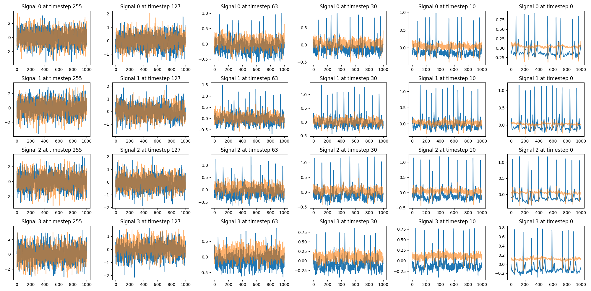
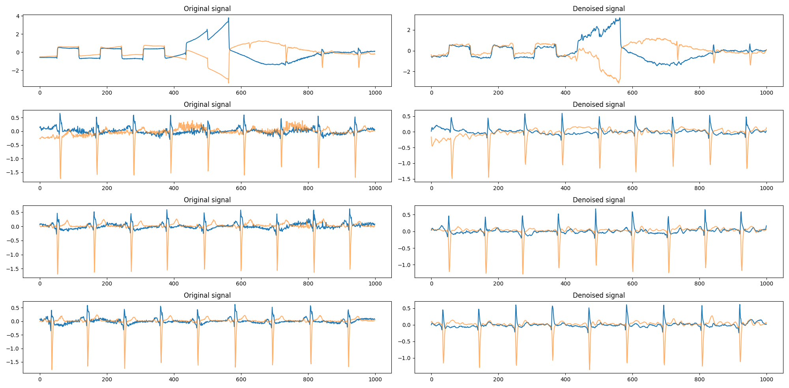

# ECG Diffusion Model

Diffusion model for creating synthetic ECG signals. Data source: https://physionet.org/content/ltafdb/1.0.0/

Processed dataset is available here: https://huggingface.co/datasets/roszcz/ecg-segmentation-ltafdb or you can run preprocessing yourself using ```python prepare_dataset.py``` after downloading dataset.

### Examples outputs (model trained for 1 epoch)
#### Generation


#### Denoising data


Samples from validation set were diffused with timestep 63, which doesn't destroy original data completely and then denoised using unet to check if model is able to generalize to different samples.


### Training
To run training:
```sh
python train.py --config-name <config>
```
**--config-name** flag is used to specify config name, it needs to be in **configs** directory

### Testing
If you wish to test model you can run sample test scripts located tests directory.

```sh
python tests/test_sampling.py
```
Checkpoints are available here: https://huggingface.co/JasiekKaczmarczyk/ecg-diffusion

### Code Style

This repository uses pre-commit hooks with forced python formatting ([black](https://github.com/psf/black),
[flake8](https://flake8.pycqa.org/en/latest/), and [isort](https://pycqa.github.io/isort/)):

```sh
pip install pre-commit
pre-commit install
```

Whenever you execute `git commit` the files altered / added within the commit will be checked and corrected.
`black` and `isort` can modify files locally - if that happens you have to `git add` them again.
You might also be prompted to introduce some fixes manually.

To run the hooks against all files without running `git commit`:

```sh
pre-commit run --all-files
```
